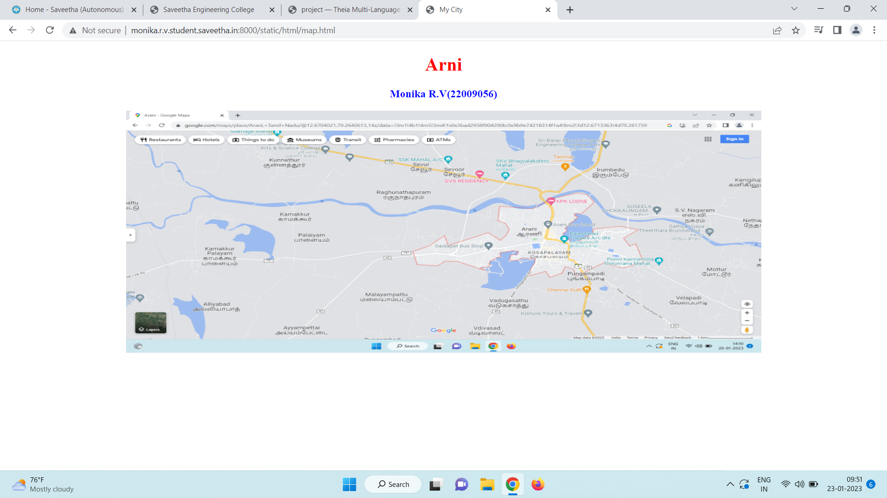
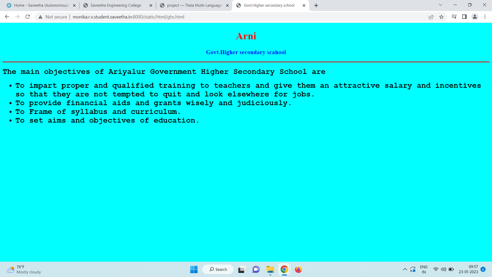
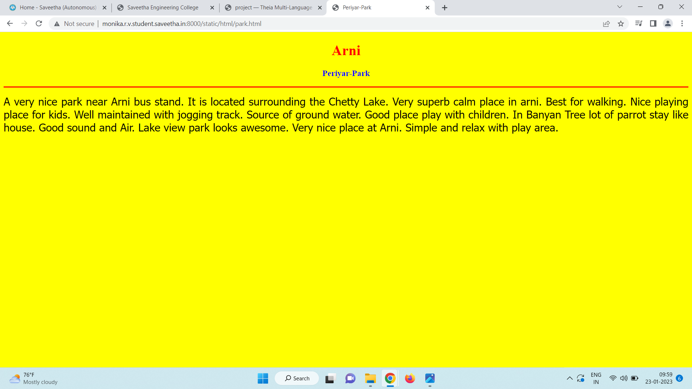
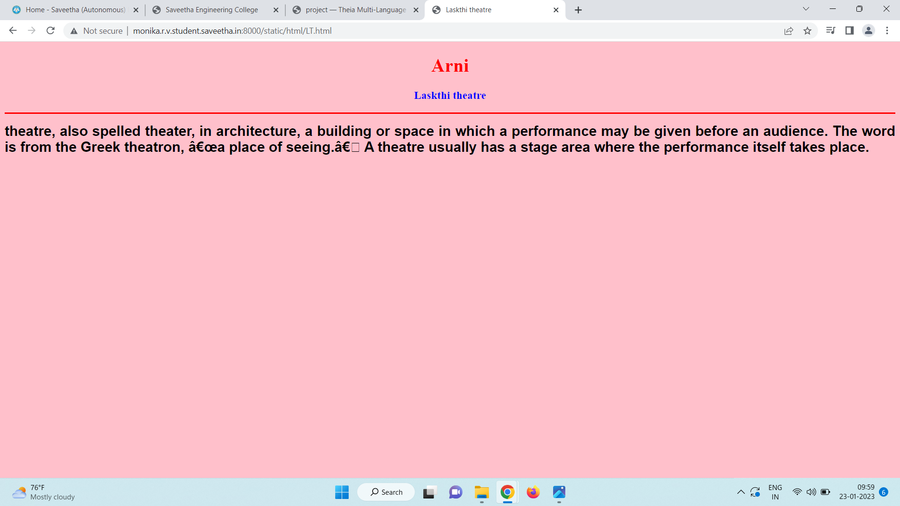
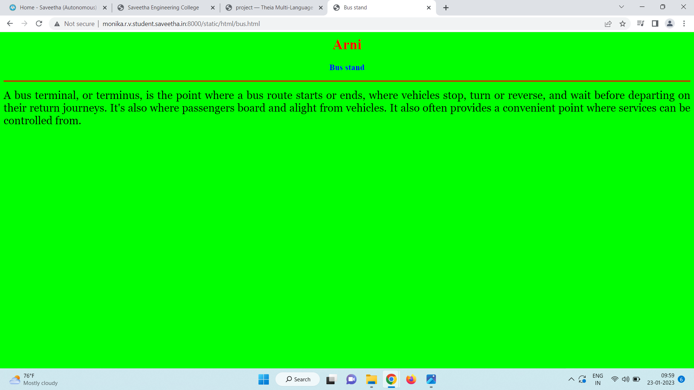
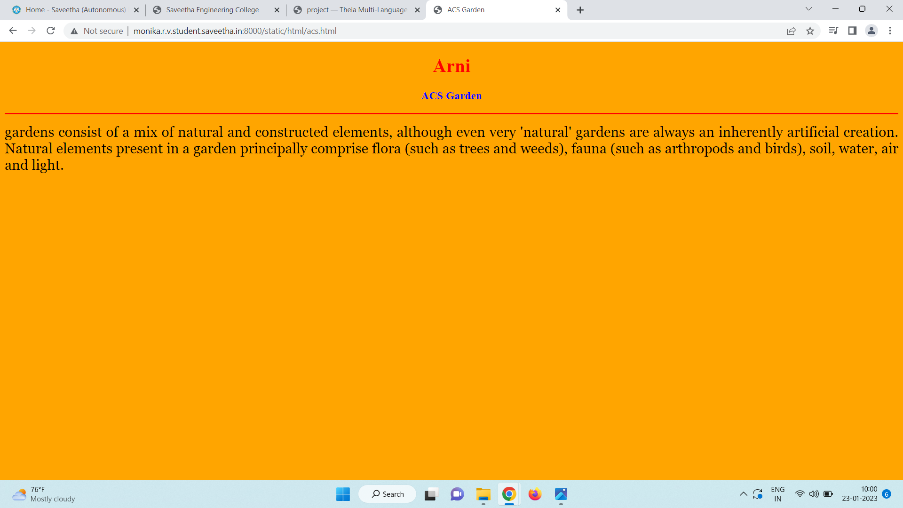
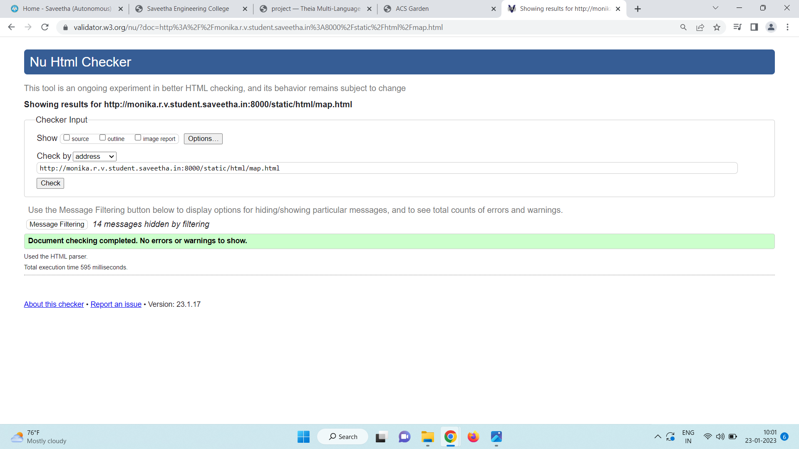

# Places Around Me
## AIM:
To develop a website to display details about the places around my house.

## Design Steps:

### Step 1:
Clone the repository from github

### Step 2:
Create image ma using mar element and push the URL

## Code:
```
map.html
<!DOCTYPE html>
<html lang="en">
<head>
<title>My City</title>
</head>
<body>
<h1 align="center">
<font color="red"><b>Arni</b></font>
</h1>
<h3 align="center">
<font color="blue"><b>Monika R.V(22009056)</b></font>
</h3>
<center>

<map name="MyCity">
<area shape="circle" coords="190,50,20" href="/static/html/ghs.html" title="Govt. Higher Secondary School">
<area shape="rectangle" coords="230,30,260,60" href="/static/html/park.html" title="Periyar-Park">
<area shape="circle" coords="400,350,50" href="/static/html/LT.html" title="Lakshmi Theatre">
<area shape="circle" coords="400,200,75" href="/static/html/bus.html" title=" Bus Stand">
<area shape="rectangle" coords="490,150,870,320" href="/static/html/acs.html" title="acs garden">
</map>
</center>
</body>
</html>

acs.html
<!DOCTYPE html>
<html lang="en">
<head>
<title>ACS Garden</title>
</head>
<body bgcolor="orange">
<h1 align="center">
<font color="red"><b>Arni</b></font>
</h1>
<h3 align="center">
<font color="blue"><b>ACS Garden</b></font>
</h3>
<hr size="3" color="red">
<p align="justify">
<font face="Georgia" size="5">
gardens consist of a mix of natural and constructed elements, although even very 'natural' gardens are always an inherently artificial creation. Natural elements present in a garden principally comprise flora (such as trees and weeds), fauna (such as arthropods and birds), soil, water, air and light.
</font>
</p>
</body>
</html>

ghs.html
<!DOCTYPE html>
<html lang="en">
<head>
<title>Govt.Higher secondary school</title>
</head>
<body bgcolor="cyan">
<h1 align="center">
<font color="red"><b>Arni</b></font>
</h1>
<h3 align="center">
<font color="blue"><b>Govt.Higher secondary scahool</b></font>
</h3>
<hr size="3" color="red">
<p align="justify">
<font face="Courier New" size="5">
<b>
The main objectives of Ariyalur Government Higher Secondary School are 
<ul>
<li>To impart proper and qualified training to teachers and give them an attractive salary and incentives so that they are not tempted to quit and look elsewhere for jobs.</li>
<li>To provide financial aids and grants wisely and judiciously.</li>
<li>To Frame of syllabus and curriculum.</li>
<li>To set aims and objectives of education.</li>
</ul>
</b>
</font>
</p>
</body>
</html>

LT.htmi
<!DOCTYPE html>
<html lang="en">
<head>
<title>Laskthi theatre</title>
</head>
<body bgcolor="pink">
<h1 align="center">
<font color="red"><b>Arni</b></font>
</h1>
<h3 align="center">
<font color="blue"><b>Laskthi theatre</b></font>
</h3>
<hr size="3" color="red">
<p align="justify">
<font face="Arial" size="5">
<b>
theatre, also spelled theater, in architecture, a building or space in which a performance may be given before an audience. The word is from the Greek theatron, “a place of seeing.” A theatre usually has a stage area where the performance itself takes place.
</b>
</font>
</p>
</body>
</html>

bus.html
<!DOCTYPE html
<html lang="en">
<head>
<title>Bus stand</title>
</head>
<body bgcolor="lime">
<h1 align="center">
<font color="red"><b>Arni</b></font>
</h1>
<h3 align="center">
<font color="blue"><b>Bus stand</b></font>
</h3>
<hr size="3" color="red">
<p align="justify">
<font face="Georgia" size="5">
A bus terminal, or terminus, is the point where a bus route starts or ends, where vehicles stop, turn or reverse, and wait before departing on their return journeys. It's also where passengers board and alight from vehicles. It also often provides a convenient point where services can be controlled from.
</p>
</body>
</html>
park.html
<!DOCTYPE html>
<html lang="en">
<head>
<title>Periyar-Park</title>
</head>
<body bgcolor="yellow">
<h1 align="center">
<font color="red"><b>Arni</b></font>
</h1>
<h3 align="center">
<font color="blue"><b>Periyar-Park</b></font>
</h3>
<hr size="3" color="red">
<p align="justify">
<font face="Tahoma" size="5">
A very nice park near Arni  bus stand. It is located surrounding the Chetty Lake. 
Very superb calm place in arni. Best for walking. Nice playing place for kids.
Well maintained with jogging track. Source of ground water.
Good place play with children.  In Banyan Tree lot of parrot stay like house. 
Good sound and Air. Lake view park looks awesome.
Very nice place at Arni.
Simple and relax with play area.
</font>
</p>
</body>
</html>
```
## Output:







## HTML Validator


## Result:
The program executed successfully